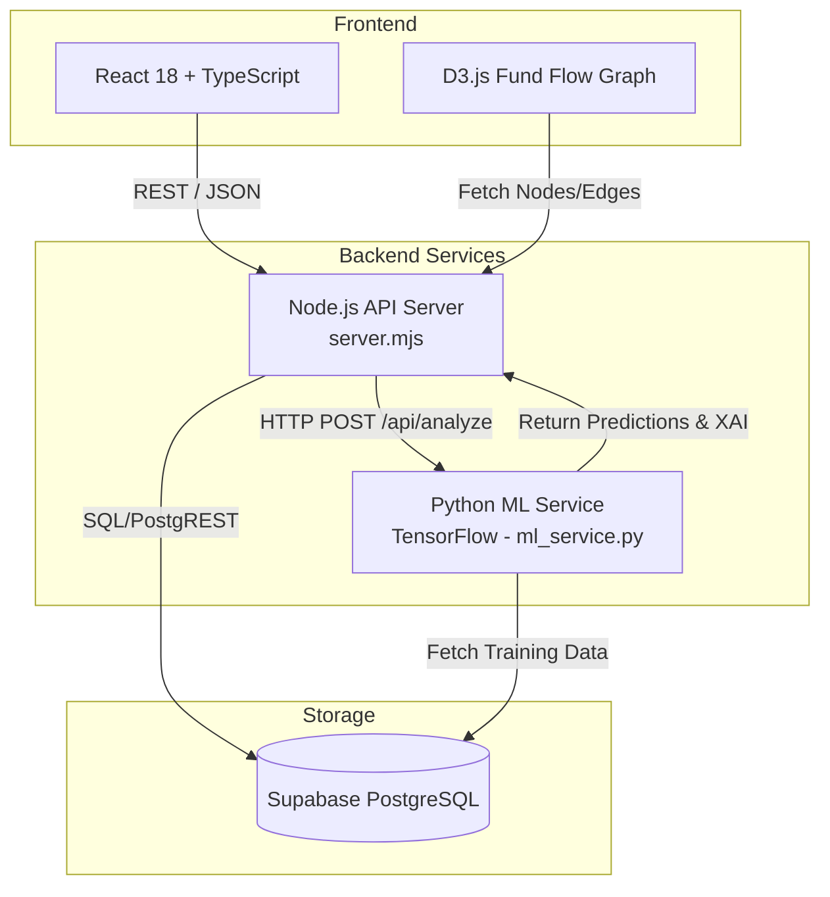

# GraphSentinel

## 1. 🚀 Problem Statement

Traditional Anti-Money Laundering (AML) systems heavily rely on static, rule-based heuristics that are increasingly inadequate against modern, sophisticated financial crimes. Illicit actors use complex obfuscation techniques such as **multi-hop layering**, **circular round trips**, and **structuring (smurfing)** to evade detection. These legacy systems suffer from notoriously high false-positive rates, overwhelming investigators and allowing subtle, temporally distributed fraud patterns to slip through undetected. The challenge lies in accurately capturing both the structural complexity of transaction networks and the temporal sequence of account behaviors simultaneously.

## 2. 💡 Solution (GraphSentinel)

**GraphSentinel** is a comprehensive financial fraud detection and AML platform designed to overcome the limitations of traditional systems. It leverages cutting-edge deep learning, specifically combining Temporal Graph Networks with Long Short-Term Memory (LSTM) sequence models, to detect multi-hop illicit financial activities in real-time. 

What makes GraphSentinel unique is its **hybrid approach**: it doesn't just look at an account's transaction history in isolation, nor does it solely look at the static network topology. Instead, it continuously evolves its understanding of the graph structure over time while maintaining temporal awareness of individual account sequences, paired with an **Explainable AI (XAI)** module to generate human-readable narratives for investigators.

## 3. 🧠 How It Works

GraphSentinel employs a sophisticated dual-pipeline machine learning architecture:

- **Graph Modeling**: Utilizes an `EvolveGCN` (Evolving Graph Convolutional Network) to capture the dynamic network topology of money flows. It processes graph snapshots over distinct time steps, learning structural embeddings that highlight hidden relationships, layering networks, and circular money trails.
- **Sequence Modeling**: Uses an `LSTM` network to analyze the temporal sequence of transactions for individual accounts, capturing behavioral anomalies, frequency surges, and volume irregularities over a defined sequence length.
- **Hybrid Detection**: The learned graph embeddings are concatenated with the LSTM sequence features. This combined feature vector is passed through dense layers to output an anomaly score, allowing the system to detect complex fraud patterns like dormant account reactivation or KYC mismatches contextualized within the broader transaction network.

## 4. ⚙️ Architecture Diagram (VERY IMPORTANT)



## 5. 🔍 Features

- **Advanced ML Detection**: Hybrid EvolveGCN + LSTM model to detect multi-hop layering, smurfing, and round trips.
- **Explainable AI (XAI)**: Generates SHAP-inspired narratives and quantitative risk factor breakdowns (e.g., volume surges, network density changes) for every alert.
- **Interactive Fund Flow Graph**: D3.js powered visualization of complex transaction networks and entity relationships.
- **Investigation Dashboard**: Priority queue for investigators to review alerts, complete with an automated feedback loop.
- **Automated Compliance Reporting**: Generates ready-to-file STR and CTR reports in standard **goAML XML** format.
- **Federated Network Support**: Architecture prepared for distributed intelligence sharing across federated nodes.

## 7. 🔌 API Examples

The Node.js server exposes RESTful endpoints for integration:

**Trigger ML Analysis & Alert Generation:**
```bash
curl -X POST http://localhost:8787/api/analyze \
  -H "Content-Type: application/json"
```

**Generate goAML XML Report:**
```bash
curl -X POST http://localhost:8787/api/reports/generate \
  -H "Content-Type: application/json" \
  -d '{"report_type": "STR", "entity_id": "acc-12345"}'
```

**Submit Investigator Feedback (Triggers Retraining Data):**
```bash
curl -X POST http://localhost:8787/api/feedback \
  -H "Content-Type: application/json" \
  -d '{"alert_id": "alrt-789", "status": "confirmed", "notes": "Clear layering pattern."}'
```

## 8. 🧪 ML Details

- **Model Pipeline**: 
  - *Data Prep*: Parses historical transactions to build sequence features (amount, channel, time deltas) and graph snapshots (adjacency matrices).
  - *Inference*: `build_model()` constructs the `EvolveGCNBlock` and `LSTM` branches. `infer_alerts()` generates confidence scores and risk factors.
- **Training Loop**: Exposed via the `/retrain` endpoint. The `train_model()` function builds a fresh training dataset from historical alerts and investigator feedback, normalizes matrices, fits the model, and saves updated weights and normalization metadata.
- **Feedback Retraining**: The system creates a continuous learning loop. When investigators confirm or dismiss alerts via the dashboard, this feedback is saved to Supabase. The `retrain` process incorporates this feedback to adjust class weights and minimize false positives dynamically.

## 9. 🚀 Deployment

The architecture is highly decoupled, allowing independent scaling:
- **Frontend**: Can be built via `npm run build` and deployed to Vercel, Netlify, or any static CDN.
- **Node.js API**: Deployable as a Docker container or via PaaS (Render, Heroku). Needs standard HTTP port access and connection strings for Supabase and the ML service.
- **Python ML Service**: Requires a compute environment with TensorFlow. Best deployed as an independent container with sufficient memory/CPU resources for inference and periodic retraining.

## 10. 🛠️ Setup

### Prerequisites
- Node.js (v18+)
- Python (v3.9+)
- Supabase account (for database setup)

### 1. Environment Setup
Create a `.env` file in the root directory:
```env
VITE_SUPABASE_URL=your-supabase-project-url
VITE_SUPABASE_ANON_KEY=your-supabase-anon-key
```

### 2. Install Dependencies
```bash
# Frontend & API Dependencies
npm install

# ML Service Dependencies
pip install tensorflow numpy
```

### 3. Run the Services (Concurrent execution required)
Open three terminal instances:

```bash
# Terminal 1: Python ML Service (Runs on port 8790)
npm run backend:ml

# Terminal 2: Node.js API Server (Runs on port 8787)
npm run backend

# Terminal 3: React Frontend (Starts Vite dev server)
npm run dev
```
